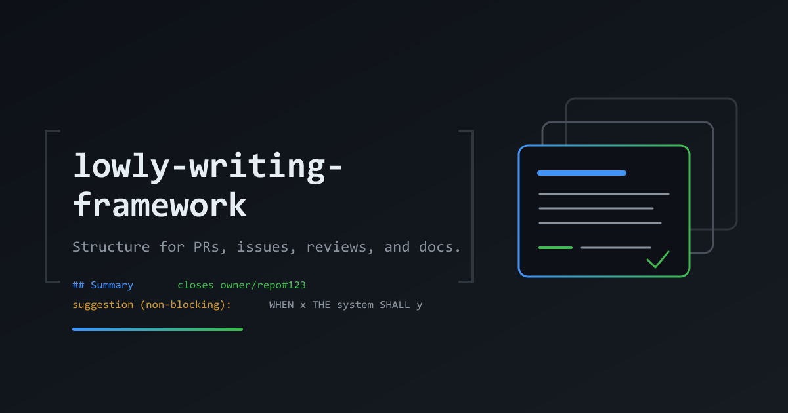

# lowly-writing-framework-plugin

<p align="center">
  
</p>

Bundles the [lowly-writing-framework](https://github.com/lowlysre/lowly-writing-framework) skill and reminds the agent to load it before a GitHub write: the gate denies the first two write attempts per session until the skill has loaded, then allows later writes. Works on Claude Code, Copilot CLI, and Codex CLI from one `.claude-plugin/` tree: Copilot CLI and Codex both accept the Claude Code plugin and hooks format, so there is a single manifest and hooks config.

| | Skill alone (`npx skills add`) | Plugin (with skill) |
|---|:---:|:---:|
| Writing framework skill | ✅ | ✅ |
| Works on Claude Code, Copilot CLI, Codex CLI | ✅ | ✅ |
| Agent decides whether to load the skill | ✅ | ✅ |
| Reminds the agent to load the skill before a GitHub write | ❌ | ✅ |
| Re-arms the reminder after context compaction | ❌ | ✅ |

> [!IMPORTANT]
> Install the plugin **or** run the skill, not both. Both register the skill, and the agent then sees it twice.

## Install

### Claude Code / Copilot CLI

```
/plugin marketplace add lowlysre/lowly-writing-framework-plugin
/plugin install lowly-writing-framework@lowly-writing-framework
```

\* Without Git on Windows, Claude Code can't run the bash hooks. Copy [`examples/claude-code-windows-settings.json`](examples/claude-code-windows-settings.json) into your user settings and replace `<plugin path>` with the installed plugin directory.

### Codex CLI

```
codex plugin marketplace add lowlysre/lowly-writing-framework-plugin
```

Codex skips plugin hooks until you trust them in `/hooks`.

## Vendored skill

`skills/` is a copy of the upstream skill at the tag in `mise.toml`, minus its `.github/`, `package.json`, and `package-lock.json`, which only serve the skill repo's own tooling. It is committed because a plugin installs by cloning this repo. The `skills` CLI records the install in `skills-lock.json` (tag `ref` plus a `computedHash` that changes with any byte, line endings included), and CI diffs `skills/` against a fresh restore from it, ignoring those three paths.

To bump, change `skill_ref` in `mise.toml`, run `mise run vendor`, and bump the plugin `version` if it should ship. `mise run verify` runs the CI check locally.

## Coverage

CI runs the gate scripts and the literal `hooks.json` commands on Ubuntu, macOS, and Windows, but no CI job installs a harness or calls a model. Live runs are manual.

| OS | Harness | Model | Live status |
| --- | --- | --- | --- |
| Windows | Copilot desktop app | Claude Sonnet 5.5 | ✅ Soft deny, hard deny, allow after a load, and `PreCompact` re-arming observed |
| Windows | Claude Code | none | ❌ Not run, the CLI was not logged in |
| Windows | Codex CLI | none | ❌ Not run |
| macOS | Any | none | ❌ Not run, covered by CI only |
| Linux | Any | none | ❌ Not run, covered by CI only |

The Copilot row is the only live evidence. [Testing](docs/testing.md) lists the untested paths.
## Docs

- [How the gate works](docs/how-the-gate-works.md): what it denies, the hook config, why Codex needs no separate config, the skill-loaded marker
- [Testing](docs/testing.md): the Pester suite and known gaps
