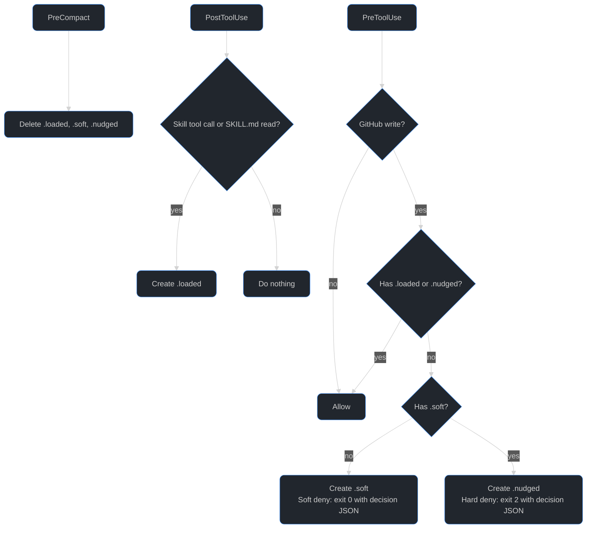

# How the gate works

The gate reminds the agent to load the `lowly-writing-framework` skill before a GitHub write by denying the first two attempts until it loads. It is a reminder, not enforcement: once both denies have fired, later writes pass. It runs as three hooks on all three harnesses: Claude Code, Copilot CLI, and Codex CLI.

- `PreToolUse` decides whether a write goes through.
- `PostToolUse` records that the skill loaded.
- `PreCompact` re-arms the gate, because compaction can drop the skill text from context.

One script pair holds the logic: `hooks/gate.sh` for bash and `hooks/gate.ps1` for Windows PowerShell 5.1 and PowerShell 7. Neither needs `jq`. An internal failure exits 0, so a broken gate never blocks work.

## What it blocks

- The MCP tools `create_pull_request`, `update_pull_request`, `add_pr_review_comment`, `edit_pr_review_comment`, `reply_to_comment`, and `reply_and_resolve_review_thread`, plus the GitHub MCP server's `issue_write`, `add_issue_comment`, `pull_request_review_write`, and `add_comment_to_pending_review`.
- `gh pr|issue|discussion create|edit|comment|review`, run through a shell tool, including global flags before the subcommand such as `gh --repo owner/repo pr create`.
- Mutating `gh api` calls: an explicit `POST`, `PATCH`, `PUT`, or `DELETE` method, field flags (`-f`, `-F`, `--field`, `--raw-field`, `--input`) on a REST endpoint, and GraphQL calls containing `mutation`.

## Flow

The markers are empty files at `<temp dir>/lowly-writing-framework/<session_id>.<marker>`:

| Marker | Meaning |
| --- | --- |
| `.loaded` | The skill loaded. Writes pass until the next compaction. |
| `.soft` | The first deny fired. |
| `.nudged` | The second deny fired. Writes pass until the next compaction. |

All three harnesses send `session_id` in the hook payload, so the files need no harness state and work the same under bash and PowerShell.

## Why two denies

Every deny prints `permissionDecision` JSON to stdout in both the top-level and `hookSpecificOutput` shapes, and writes the reason to stderr. Copilot CLI reads the top-level fields, and Claude Code and Codex read the `hookSpecificOutput` form.

The first deny exits 0. Copilot CLI treats any non-zero `preToolUse` exit as a crash and ignores stdout, so a first deny with exit 2 would hide the reason.

If the agent retries without loading the skill, the second deny exits 2. That is the backstop for a harness that ignored the exit-0 decision and ran the write anyway. The next write after that passes.

## Detecting a skill load

- Claude Code and Copilot CLI load a skill through a `Skill` or `skill` tool call, which `PostToolUse` records.
- Codex has no skill tool. The model reads `SKILL.md` through its shell, so the shared `PostToolUse` matcher also covers `Bash`, and the gate records a call that mentions `lowly-writing-framework/SKILL.md`.

## Compaction

`PreCompact` deletes all three markers. The next write is denied again and the agent reloads the skill. If the harness keeps the skill through compaction, the cost is extra reminders. Claude Code, Copilot CLI, and Codex each document a pre-compaction event.

## Compatibility

The plugin targets the Claude Code plugin spec, and the other two harnesses accept that format:

- Copilot CLI's [hooks reference](https://docs.github.com/en/copilot/reference/hooks-reference) accepts PascalCase event names (`PreToolUse`) in the Claude Code shape, with Claude matcher semantics and `snake_case` payload fields. Its native `camelCase` flat format is not used.
- Codex's [plugin docs](https://developers.openai.com/plugins/build/plugins) say OpenAI "also accepts legacy and Claude-compatible manifests" and that Codex discovers `hooks/hooks.json` by default. Codex skips plugin hooks until the user trusts them in `/hooks`.

The only additions to the Claude shape are per-OS command keys, so one `hooks/hooks.json` serves all three:

| Key in `hooks/hooks.json` | Read by |
| --- | --- |
| `command`, `bash` | Claude Code (`command`), Copilot CLI on Linux and macOS (`bash`), Codex on Linux and macOS (`command`) |
| `powershell` | Copilot CLI on Windows |
| `commandWindows` | Codex on Windows |

Two details of the config:

- The `PreToolUse` matcher is `Bash|(.*(__|-))?(<tools>)`. MCP tool names arrive prefixed with `__` on Claude Code and `-` on Copilot CLI.
- Copilot CLI runs the `powershell` field through `pwsh -c`, which reports exit code 1 for any failed native command. The trailing `; exit $LASTEXITCODE` restores the hard deny's exit code 2.